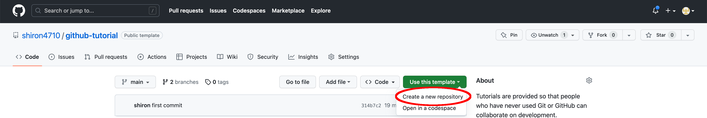
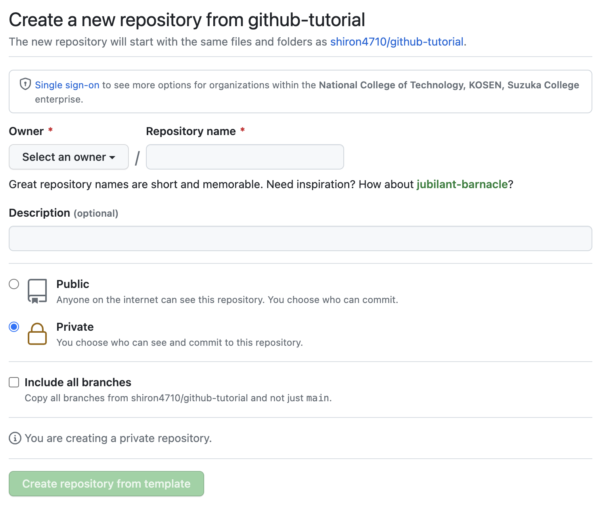

# GitHub Tutorial

## はじめに

このリポジトリでは、Git や GitHub を使ったことがない人でも共同開発が行えるようにチュートリアルを提供します。
このリポジトリを使用して Git/GitHub の使い方を学習するには、次の手順に従ってください。

### 学習を開始する

まずは、以下の手順に従ってリポジトリを作成してください。
(「リポジトリ」等のワードについての説明はのちに行います。)

1. 画像のボタンを押してください。
   

1. - Owner の部分はすでに選択されていたら、何もしなくても構いません。画像のように"Select an owner"となっていた場合は自分の GitHub のアカウントを選択してください。
   - Repository name にはわかりやすい名前を自由に入力してください。例えば、例として- "github-tutorial"とかが良いでしょう。
   - 鍵のマークがついた Private が選択されていることを確認してください。
   - Include all branches はチェックが外れていることを確認してください。
     
1. 緑の"Create repository from template"というボタンを押しましょう。
   すると、自動的に画面が切り替わり、ここに表示されるメッセージも更新されます。

## ライセンス

本リポジトリは MIT ライセンスで公開されています。
