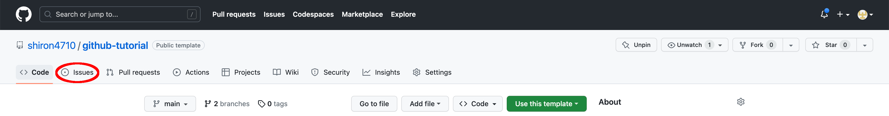
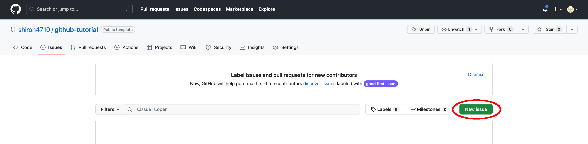
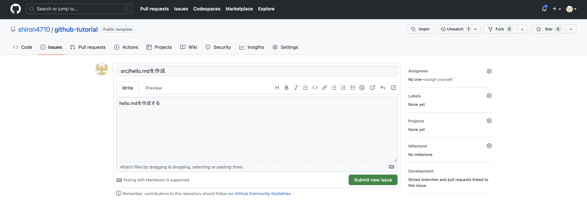

## GitHub を操作してみる

GitHub と Git を使用した共同開発をステップバイステップで擬似的に体験しましょう。

まずは issue を立てます。issue を立てることにより、自分が今から行うタスクが整理され、自分がするべきことがわかりやすくなるほか、共同編集者からも自分が現在どのタスクを行なっており、進捗がどれくらいなのかがわかりやすくなります。

1. issue の画面を開く
   

2. New issue から issue を作成する
   

3. issue のタイトルと内容を入力する
   issue のタイトルと内容を入力してください。タイトルは作業内容や問題点がわかりやすいように簡潔に記述してください。
   issue の書き方などが`CONTRIBUTING.md`に記述されているリポジトリもあります。その場合はそのリポジトリの方針に従いましょう。また、issue のテンプレートが設定されている場合がありますので、その場合もテンプレートに従ってください。

   今回の例ではタイトルを**必ず**

   ```
   create src/hello.md
   ```

   としてください。

   

   > **Warning**
   > 本リポジトリでは学習のために issue の内容を検知して自動的にドキュメントを更新しています。そのため、issue のタイトルは一言一句同じにしてください。コピーしてペーストすることをお勧めします。

ここまでの手順が終了したら、十数秒待った後、GitHub 上でリポジトリのトップページに戻ってください。トップページの文章が更新され、次の説明が表示されています。
