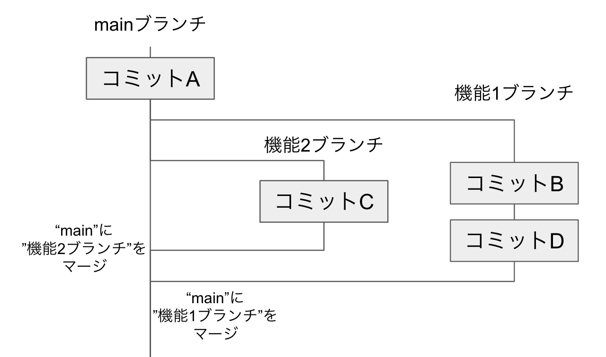

## 共同開発・GitHub に関する用語の説明

#### ブランチ(Branch)

リポジトリ内で、コミット履歴を分岐させるためのものです。ブランチを作成することで、複数人で同時に開発することができます。
例えば、機能 1 と機能 2 を同時に開発するときに、ブランチを分けることで、お互いの編集中のコードを混ぜることなく開発ができます

#### マージ(Merge)

あるブランチの変更内容を別のブランチに取り込むことです。
ブランチのマージには、手動でマージする方法と、ツールを使ってマージする方法があります。手動でマージする場合は、変更内容を確認しながらマージすることができます。一方、ツールを使ってマージする場合は、GitHub Actions や CI/CD パイプラインなどの自動化ツールや、GitHub のプルリクエストを使用することができます。ツールを使用する場合、手動でマージする場合よりも効率的であり、人為的なミスを防止することができます。

#### イシュー(Issue)

GitHub に搭載されたバグ報告や改善要望などの問題を管理するための機能です。タイトルやコメント、ラベル、マイルストーンなどを設定できます。イシューを作成することで、開発者同士のコミュニケーションやタスクの管理がしやすくなります。

#### プルリクエスト(Pull Request)

GitHub に搭載されたブランチに対して、変更内容をレビューしてマージを依頼する機能です。プルリクエストを作成することで、コードの品質や変更の内容をレビューし、問題を発見した場合には修正を行うことができます。ローカルリポジトリでコマンドを使用し手動でマージするのと比べて、レビューができるという点などさまざまな点で優れているため、基本的に GitHub を使用した共同開発/個人開発ではプルリクエストを使用してマージを行います。
プルリクエストは PR と略されることが多々あります。

Issue を元にブランチを切り(作成し)、そのブランチで開発を行った後コミットを行い、Pull Request を作成します。個人開発の場合は自分でそのまま PR をマージし、共同開発の場合はレビューをしてもらった後にマージを行います。その後、Issue を閉じます。一般的な開発はこう言った流れで行います。
また、Issue を作成せずに他の管理ツールを使用したりし開発を行う場合もありますが、そのような場合でもブランチを切って PR を作成、マージする手順は一般的に同じです。

#### CI/CD

CI（Continuous Integration）と CD（Continuous Deployment/Delivery）は、コードの品質管理やビルド、テスト、デプロイを自動化するための仕組みです。GitHub Actions などのツールを使って、開発者が変更をコミットするたびに自動で CI/CD が実行されるように設定することができます。
つまり、コードが規則に従っているか、バグがないかなどを自動的に確認するのが CI で、自動的にビルドしデプロイ、配布などを行うのが CD です。一般的に CI/CD を導入することによって開発体験が向上します。

#### GitHub Actions

自動化されたワークフローを作成できる機能です。ビルド、テスト、デプロイなどのタスクを自動で実行することができます。GitHub に用意された CI/CD を達成するためのツールと言えるでしょう。
