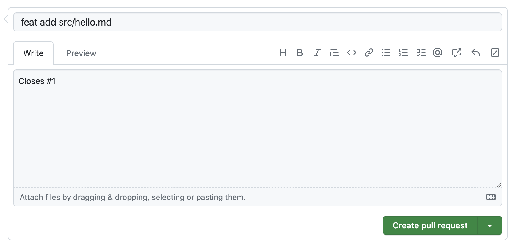

## PR を立てる

GitHub 上で、プルリクエストを作成しましょう。

1. Pull の画面を開く
   

2. New Pull request からプルリクエストを作成する
   

3. プルリクエストのブランチを選択する
   画像のように`feat/#1`から`main`にマージを行う PR を作成してください。
   

4. プルリクエストのタイトルと内容を入力する
   プルリクエストのタイトルと内容を入力してください。タイトルは作業内容がわかりやすいように簡潔に記述してください。
   プルリクエストの書き方などが`CONTRIBUTING.md`に記述されているリポジトリもあります。その場合はそのリポジトリの方針に従いましょう。また、プルリクエストのテンプレートが設定されている場合がありますので、その場合もテンプレートに従ってください。

   今回の例ではタイトルを`feat add src/hello.md`としました。今回の場合は、わかりやすければ何でも良いでしょう。

   また、内容を以下のように記述することによって、プルリクエストがマージされた際に自動的に issue が閉じられるようになります。

   ```
   Closes #1
   ```

   

ここまでの手順が終了したら、十数秒待った後、リロードしてみてください。Bot さんがレビューしてくれているはずです。普通はこんなにレビューは早くないので、レビューアーさんを責めないであげてください。

レビューが届いたらマージを行いましょう。マージを行うと、自動的に issue が閉じられます。
また、リポジトリによっては、マージを行う権限がない場合があります。その場合はコントリビューターによってプルリクエストが承認され、マージが行われるのを待ちましょう。

マージが完了したら、十数秒待った後、GitHub 上でリポジトリのトップページに戻ってください。トップページの文章が更新され、次の説明が表示されています。
