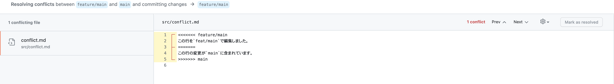
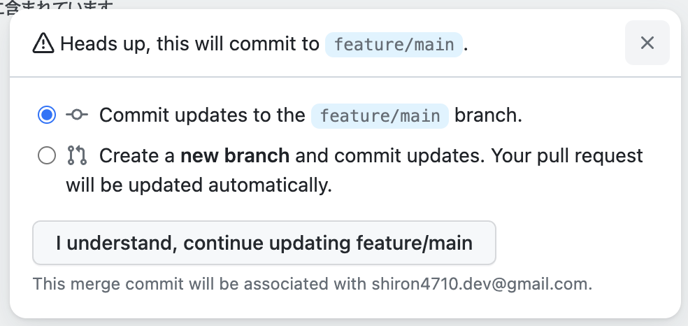

## コンフリクトの解消(説明)

ここではコンフリクトの解消方法を学び、実際にコンフリクトを解消してみましょう。
[実践へ](/docs/contrib2/resolve-conflict.md)

### コンフリクト(Conflict)

複数人で同じファイルを編集した場合に、異なる変更が同じ行に加えられてしまうと、Git はどちらの変更を採用すべきか判断できず、コンフリクト(Conflict)が発生します。つまり、コンフリクトは、同じ箇所を複数の人が同時に変更し、どちらの変更を優先するべきかを判断できない状態のことを指します。

このような状況に陥ると、Git はコンフリクトが発生したファイルを自動的にマージできなくなります。そのため、手動でコンフリクトを解決する必要があります。コンフリクトを解決するには、マージ対象のファイルを開いて、自分が加えた変更と、他の人が加えた変更を比較しながら、適切な修正を行う必要があります。

一人一つのブランチを使用して開発をしている限りは、コンフリクトは発生しません。しかし、GitHub 上でプルリクエストを行うとコンフリクトが発生する場合があります。これは、ソースのブランチの編集とマージ先のブランチの編集したファイルの行が重複してしまったためです。

Git では、コンフリクトが発生することは珍しくありませんが、解決することでチーム全体のコラボレーションを促進し、スムーズな開発プロセスを進めることができます。
コンフリクトを解消する方法はいくつかありますが、ここでは、コンフリクトを解消するための基本的なふたつの方法を示します。

### コンフリクトを解消する

今回はコンフリクトを解消する方法として、エディタを使用する方法と、GitHub のウェブサイト上から行う方法のふたつを紹介します。
また、今回は、GitHub 上で`feat/main`から`main`に向けてのプルリクエストを行ったところコンフリクトが発生したというシナリオで行います。説明の後にある演習でも同様のシナリオでコンフリクトを解消していただきます。

#### エディタ(VS Code)を使用してコンフリクトを解消する

エディタを使用してコンフリクトを解消する手順を示します。ここでは例として VS Code を使用しますが、他のエディタでも同様の手順でコンフリクトを解消することができます。
また、GitHub 公式のドキュメントも参照してください。[GitHub 公式のドキュメント](https://docs.github.com/ja/pull-requests/collaborating-with-pull-requests/addressing-merge-conflicts/resolving-a-merge-conflict-using-the-command-line)

1. マージするための準備

   まずは、マージするための準備をします。以下のコマンドを実行します。

   ```
   git pull origin main
   git pull origin feat/main
   ```

   これにより、リモートリポジトリの最新の変更が取得され、現在のブランチにマージされます。

2. コンフリクトが発生したブランチに移動する

   次に、コンフリクトが発生したブランチに移動します。これは、GitHub でマージを行う際にコンフリクトが発生したソース側のブランチです。

   ```
   git checkout feat/main
   ```

3. コンフリクトを解消する

   ここからがコンフリクトの解消作業です。まずは、VSCode を開いて、コンフリクトが発生したファイルを開きます。開いたファイルには、以下のようなマークアップが表示されます。

   ```
   <<<<<<< HEAD
   この行を`feat/main`で編集しました。
   =======
   この行の変更が`main`に含まれています。
   >>>>>>> main
   ```

   `<<<<<<< HEAD`から`=======`までが自分が変更したコードであり、`=======`から`>>>>>>> other_branch`までが他の人が変更したコードです。

   これらのコードを比較し、どちらの変更を採用するか決定します。例えば、自分の変更を採用する場合は、他の人が変更したコードを削除し、`<<<<<<< HEAD`と`=======`を削除します。逆に、他の人の変更を採用する場合は、自分が変更したコードを削除し、`=======`と`>>>>>>> other_branch`を削除します。

   今回は、どちらも重要な変更であるため、以下のように両方の変更を採用することにします。

   ```
   この行を`feat/main`で編集しました。
   この行の変更が`main`に含まれています。
   ```

   > **Note**
   > VS Code では GUI を使用し視覚的にコンフリクトを解消することもできます。

4. 変更をステージングする

   コンフリクトを解消したら、変更をステージングします。以下のコマンドを実行します。

   ```
   git add .
   ```

5. コミットする

   ステージングした変更をコミットします。以下のコマンドを実行します。

   ```
   git commit -m "Merge branch 'main' into feature/main"
   ```

6. リモートリポジトリにプッシュする

   ```
   git push
   ```

これで、コンフリクトを解消して、リモートリポジトリに変更をプッシュすることができます。

以上が、Git を使用してコンフリクトを解消する一般的な手順になります。VSCode の場合は、Git の機能を統合しているため、上記の手順を VSCode の GUI で実行することもできます。

#### GitHub のウェブサイト上からコンフリクトを解消する

GitHub の Web UI を使用してコンフリクトを解消する方法です。

1. Web editor を開く
   PR でコンクリフトが発生すると、画像のような表示がされると思います。この画面から、Resolve conflicts を押し、Web editor を開きます。
   
2. Web editor で解決する
   したのような画面が表示されます。ここで、コンフリクトを解消します。
   

   開いたファイルには、以下のようなマークアップが表示されます。

   ```
   <<<<<<< HEAD
   この行を`feat/main`で編集しました。
   =======
   この行の変更が`main`に含まれています。
   >>>>>>> main
   ```

   `<<<<<<< HEAD`から`=======`までが自分が変更したコードであり、`=======`から`>>>>>>> other_branch`までが他の人が変更したコードです。

   これらのコードを比較し、どちらの変更を採用するか決定します。例えば、自分の変更を採用する場合は、他の人が変更したコードを削除し、`<<<<<<< HEAD`と`=======`を削除します。逆に、他の人の変更を採用する場合は、自分が変更したコードを削除し、`=======`と`>>>>>>> other_branch`を削除します。

   今回は、どちらも重要な変更であるため、以下のように両方の変更を採用することにします。

   ```
   この行を`feat/main`で編集しました。
   この行の変更が`main`に含まれています。
   ```

3. 解決する
   コンフリクトが起こっている部分を全て解消し、Mark as resolved を押すと、そのファイルのコンフリクトがされ、解決済みになります。
   全てのファイルのコンフリクトを修正し、Commit merge を押すと、コンフリクトを解消したことがコミットされます。その際、同じブランチでマージのコミットをしても良いかと聞かれますが、今回は同じブランチでコミットしてください。

   

これでコンフリクトが解消され、PR をマージできるようになっていると思います。

では、次に実際にコンフリクトを解消していきましょう。
[実践へ](/docs/contrib2/resolve-conflict.md)
