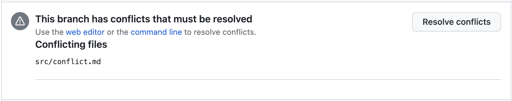

## コンフリクトの解消(実践)

では実際にコンフリクトの解消を行っていきましょう。コンフリクトの解消手順はここでは説明しません。コンフリクトの解消については、[コンフリクトの解消(説明)へ](/docs/contrib2/conflict.md)
今回は、Bot さん(共同編集者)が`feat/main`ブランチを作成したようなので、`feat/main`から`main`に向けて PR を作成してみましょう。

次のような PR を作成してください。タイトルと、内容は自由な内容を入力して構いません。わかりやすいような名前にできると良いでしょう。

### コンフリクトを解決する

1. コンフリクトの発生を確認

   PR を作成すると、コンフリクトが発生していることがわかります。このコンフリクトを解消しましょう。

   

2. コンフリクトを解消
   コンフリクトを解消してください。自由な方法で解消して構いません。方法がわからない場合は説明に戻ってみましょう。[コンフリクトの解消(説明)へ](/docs/contrib2/conflict.md)

3. PR をマージする
   コンフリクトが解消されたらマージができるようになっているはずです。マージしてみましょう。

これでコンフリクトを解消できるようになりましたね！

十数秒待った後 GitHub のリポジトリのトップページに戻ると表示が更新されています。
