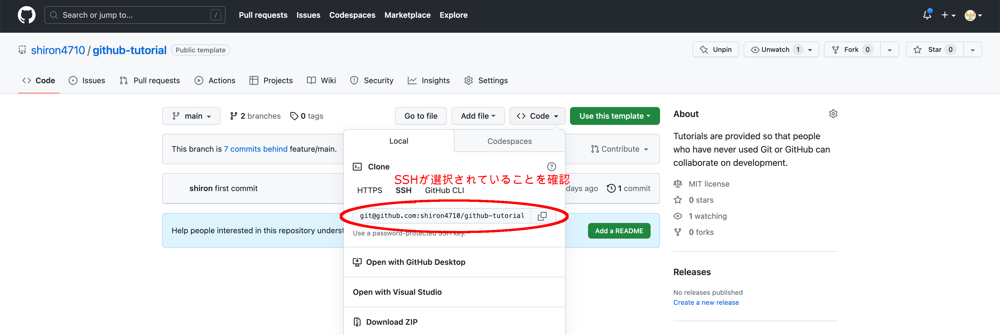

## Git の操作手順

Git の簡単な操作をしてみましょう。用語についての解説は[用語の解説](/docs/env/words.md)を参照してください。

1. リポジトリのクローン

まず、リポジトリをクローンし、ローカルリポジトリを作成します。一般的にローカルリポジトリを作成する場合は、リモートリポジトリをクローンする方法と、`git init`を実行し、新規でリポジトリを作成する方法がありますが、今回はクローンを行います。
クローンを行うにはリモートリポジトリの URL を取得する必要があります。GitHub では以下のように URL を取得できます。



```
git clone <リポジトリのURL>
```

このコマンドを実行すると、指定したリポジトリがローカル環境にクローンされます。

2.  ファイルの編集

実際にファイルを編集してコミットしてリモートリポジトリに反映させるところまでをやってみましょう。
ローカルリポジトリ内の src/sample.md にファイル編集用のサンプルファイルがあります。このファイルを編集してください。

> **Warning**
> src/sample.md 以外を編集すると次の章に進めなくなります。演習として、必ず src/sample.md を編集してください。

3. ファイルのステージング

編集したファイルをコミットに含めるために、ステージングエリアに追加します。次のコマンドを実行すると、指定したファイルがステージングエリアに追加されます。

```
git add src/sample.md
```

また、変更したすべてのファイルをコミットに含めても良い場合は次のコマンドでもステージングすることができます。

```
git add .
```

4.  コミット

ステージングエリアに追加されたファイルを、ローカルリポジトリにコミットします。

```
git commit -m "<コミットメッセージ>"
```

このコマンドを実行すると、指定したコミットメッセージとともに、ファイルの変更履歴がローカルリポジトリに記録されます。
コミットメッセージを指定することで、コミットに名前をつけることができます。一般的に`edit src/sample.md`など何を変更したかがわかるようにすると良いでしょう。コミットメッセージの付け方のガイドなどに関しては後で説明します。

5.  プッシュ

ローカルリポジトリにコミットしたファイルを、リモートリポジトリにプッシュします。これにより、ローカルで変更したリポジトリをリモートと同期することができます。

```
git push origin main
```

このコマンドを実行すると、指定したブランチに、ローカルリポジトリにコミットしたファイルがプッシュされます。ブランチ等の説明は後に行います。

ここまで実行した後、十数秒待ち GitHub のリポジトリのメインページに飛んでください。
