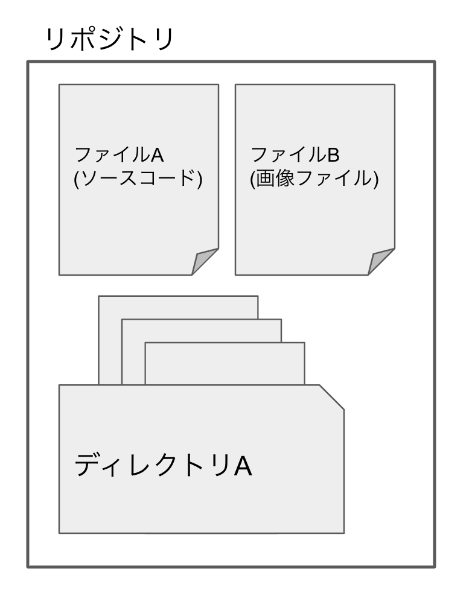
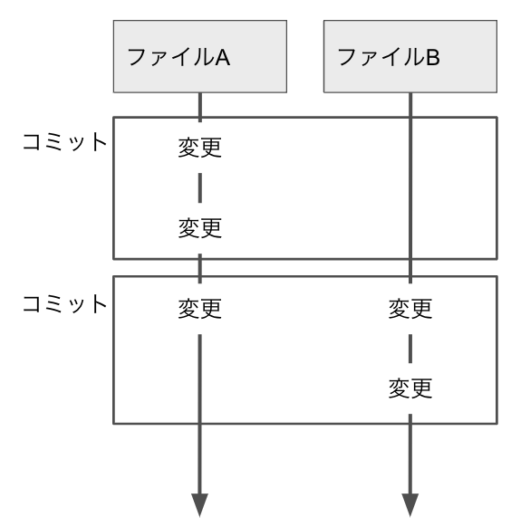
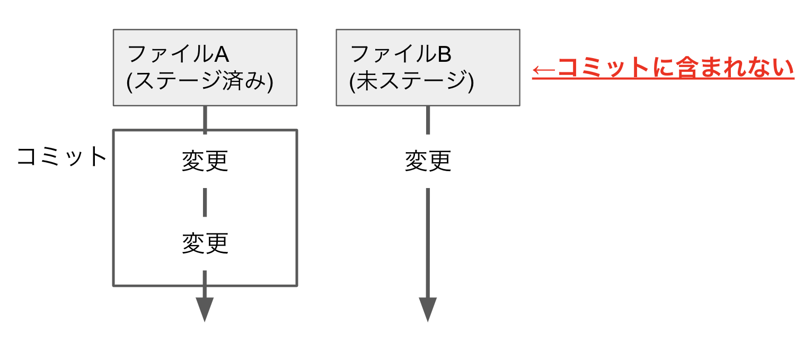
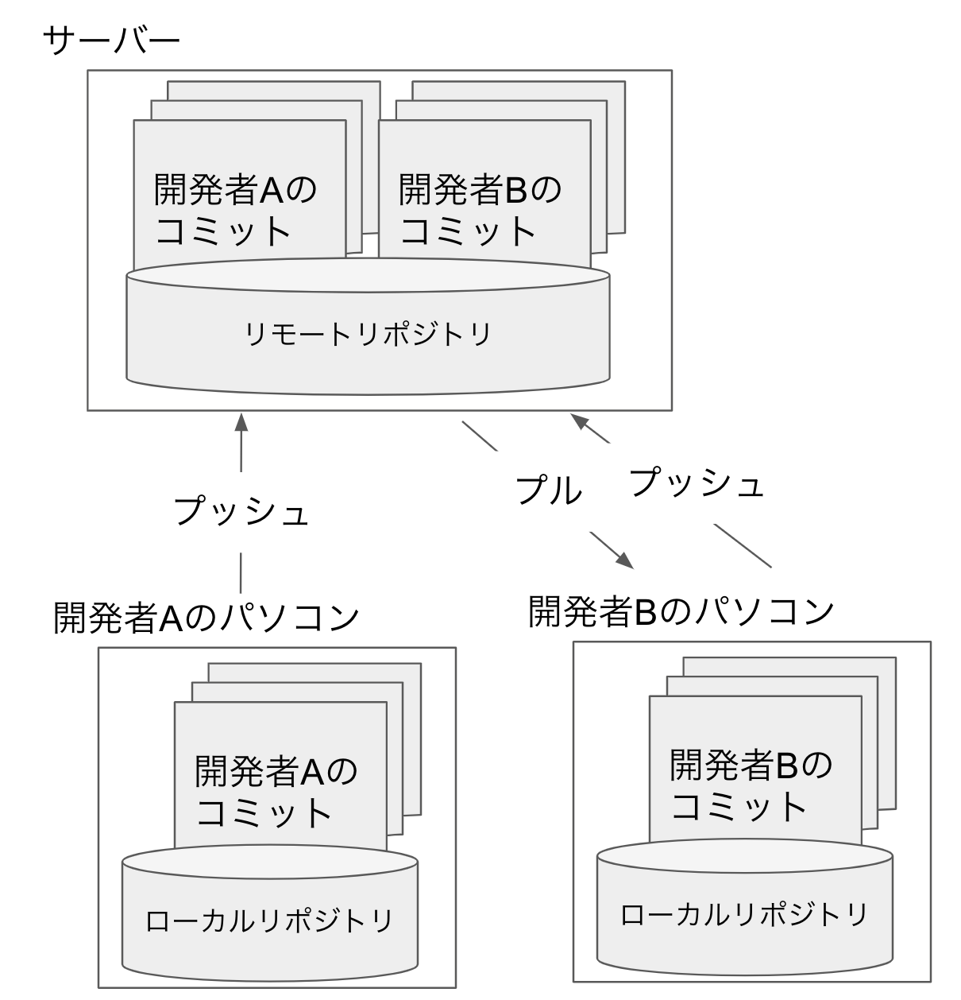

## 簡単な用語解説

詳細な解説は後に回して簡単に Git と GitHub について、以降の演習のために最低限の操作が行えるように用語を説明していきます。詳細な説明は後回しにし、初学者でもわかるような説明を優先したため、本来の意図とズレた説明などある可能性がありますが、ご了承ください。

#### Git

ソースコードのバージョン管理を行うソフトウェアです。開発者の皆さんのコンピュータの上で動作し、コマンドを叩くことにより操作をします。

#### GitHub

この Web サイト/サービスのことです。Git はあなたのコンピュータで動くソフトで、GitHub はインターネットにあるサービスです。しっかりと区別するように注意してください。
以降しばらくは、Git と言われたらあなた自身のコンピュータでコマンドの操作、GitHub と言われたらブラウザから github.com を操作するのだと条件反射的に思っていただいて構いません。

#### リポジトリ

Git が管理するファイル群のことを指します。つまり Git に管理して欲しいディレクトリのことをリポジトリと呼びます。一つのリポジトリの中には複数のファイル(ソースコード等)、ディレクトリを作成することができ、それらも Git によって管理されます。

#### コミット

Git で変更履歴を保存するための単位です。
Git ではファイルの変更履歴を管理しています。その変更のバージョンをコミットと呼びます。コミットは自分の好きなタイミングで行うことができます。
コミットは複数のファイルの変更をまとめて行うことができます。

#### ステージ

ステージとは、Git でコミットするファイルのことです。ステージングは、Git で変更をコミットする前に、コミットする変更を選択するための作業です。ステージングは、コミットするファイルを選択的に追加したり、変更の削除を行ったりすることができます。
つまり、コミットをする前にステージングを行いコミットに含むファイルを選択する必要があります。

#### ローカルリポジトリ

自分のコンピューター上に保存されている Git リポジトリのことを指します。Git では、開発者が変更を加えた後、ローカルリポジトリにコミットして変更履歴を保存します。

#### リモートリポジトリ

サーバー上の Git リポジトリのことを指します。リモートリポジトリは、複数の開発者がプロジェクトの変更を共有し、コードの変更を確認するための中央の場所として機能します。リモートリポジトリは、GitHub をはじめとしたさまざまなサービスで提供されていたり、自分でローカルリポジトリを立てたりし、開発者はローカルリポジトリとリモートリポジトリを同期することで、コードを共有できます。

#### プッシュ

ローカルリポジトリの変更をリモートリポジトリに反映させるための操作を指します。変更をコミットした後、プッシュすることでリモートリポジトリに変更を反映させます。

#### プル

リモートリポジトリから最新の変更をローカルリポジトリに反映させるための操作を指します。ローカルリポジトリが最新の変更を反映していない場合、プルすることで最新の変更を取得できます。

#### クローン

リモートリポジトリを複製して、自分のローカル環境にリポジトリを作成する操作を指します。クローンを行うことで、リモートリポジトリと同じ状態のリポジトリを自分のローカル環境で使用できます。
要するに、リモートリポジトリの内容をそっくりそのままダウンロードしてローカルリポジトリを作成する操作を指します。
