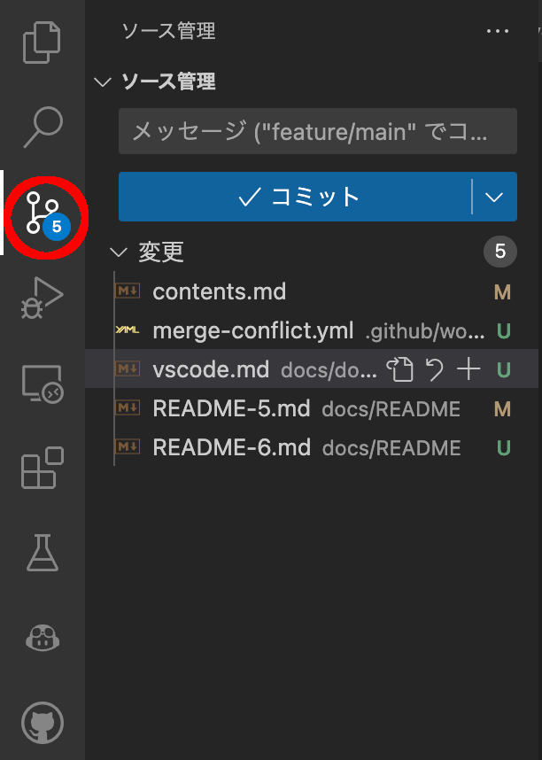
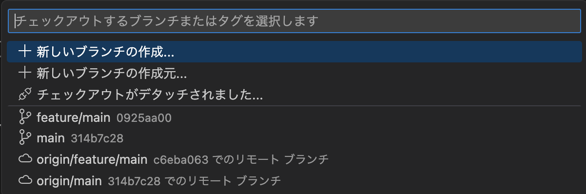
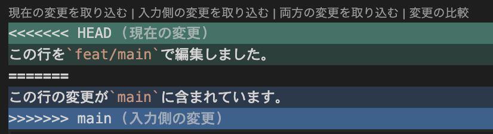
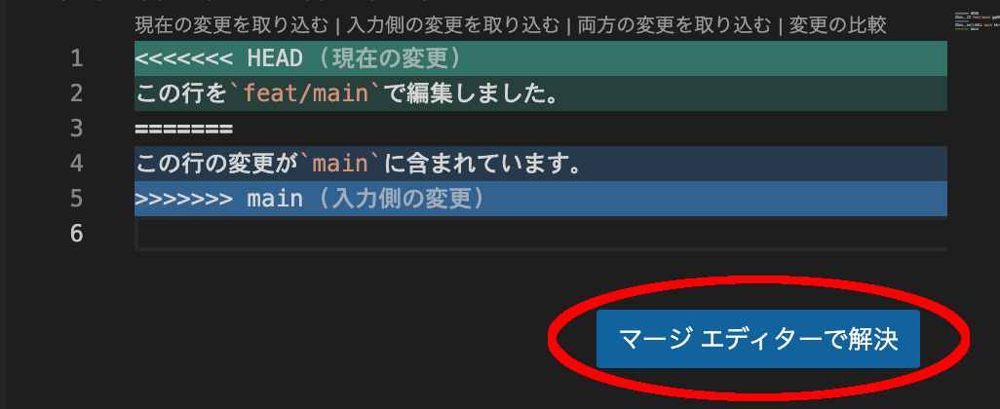
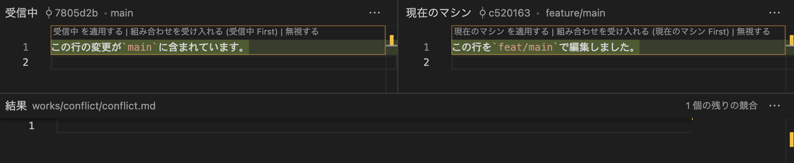

## VS Code での Git の使用

VS Code やさまざまなエディターでは Git がサポートされています。そこで、コマンドだけではなく、VS Code で Git を操作する方法を紹介します。

以降、基本的に VS Code のソースの管理というサイドバーを使用します。VS Code から Git の操作をしたい場合は、このサイドバーを使用してください。

#### 変更のステージング

VS Code ではステージングしたいファイルを GUI で簡単に選択することができます。

変更内容をステージングするには、以下の手順を行います。

1. 変更内容を含むファイル名の横に表示されている"+"マークの「変更をステージ」をクリックします。また、全てのファイルをステージしたい場合は、「変更」の右側に表示されている"+"マークの「すべての変更をステージ」をクリックします。
2. ステージングされたファイルは、「ステージされている変更」で確認できます。

#### コミット

VS Code を使用してコミットするには、以下の手順を行います。

1. コミットメッセージを入力します。
1. 「コミット」をクリックします。

> **Note**
> VS Code ではステージされたファイルがひとつもない場合、全てのファイルを自動的にステージしコミットに含めることができます。全てのファイルをステージしたい場合は、ステージを行わずにコミットを行ってください。

#### プッシュ/プル

プッシュ/プルをするには、以下の手順を行います。

1. 「変更の同期」をクリックして、変更内容をリモートリポジトリ/ローカルリポジトリに反映します。

#### チェックアウト

チェックアウトをするには、以下の手順を行います。

1. 右下のブランチの部分をクリックしてください。ボタンには現在のブランチ名が表示されます。そのため表示されているテキストが画像と違う場合があります。
   
2. 画面上部にブランチの一覧が表示されます。チェックアウトしたいブランチをクリックしてください。
   

#### コンフリクトの解消

VS Code では、エディタやツールを使用して簡単にコンフリクトを解消することができます。

##### テキストエディタとして解消

1. コンフリクトが発生したファイルを開きます。
2. コンフリクトが発生している部分の上部に四つのボタンがあり、それを選択することにより半自動的なコンフリクトの解決を行うことができます。
   
3. あとは、普段と同じようにコミットを行うことができます。

##### マージツールを使用して解消

1. コンフリクトが発生したファイルを開きます。
2. 右下のマージエディタで解決をクリックします。
   
3. マージツールが起動します。マージツールを使用してコンフリクトを解消します。
   
4. あとは、普段と同じようにコミットを行うことができます。

### 拡張機能の利用

VS Code では、Git の機能をより便利に使用するための拡張機能が提供されています。以下に代表的な拡張機能を紹介します。

##### GitLens

GitLens は、VS Code で Git をより効率的に使用するための拡張機能です。GitLens を使用することで、リポジトリの履歴やブランチ、コミット、コードの変更履歴などを簡単に確認することができます。また、リモートリポジトリの変更を通知してくれる機能もあります。

##### Git History

Git History は、VS Code で Git の履歴を確認するための拡張機能です。Git History を使用することで、過去のコミットや変更履歴を視覚的に表示することができます。また、コミットメッセージや変更内容を検索することも可能です。

##### Git Graph

Git Graph は、VS Code で Git のブランチやコミットを視覚化するための拡張機能です。Git Graph を使用することで、ブランチの分岐やマージの様子をグラフで確認することができます。また、特定のブランチやコミットを簡単にチェックアウトすることもできます。
